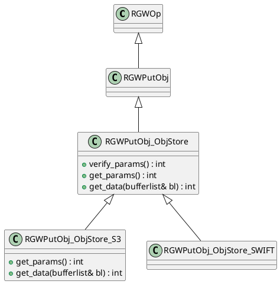
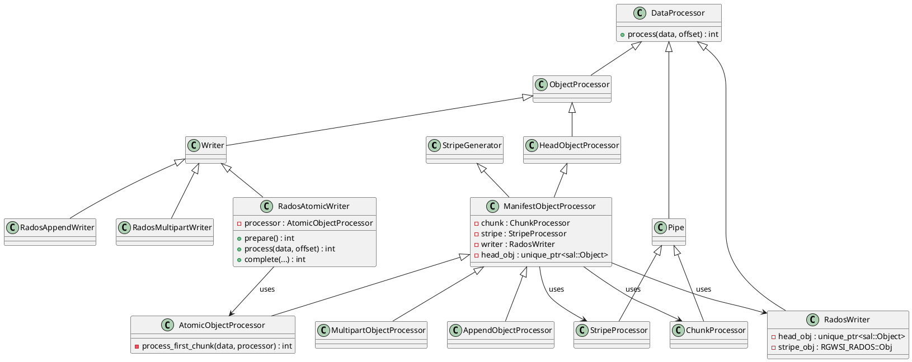
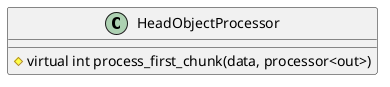

> rgw支持S3和Swift协议，我们目前主要分析S3协议下的对象上传流程。




```c++
RGWOp::execute
  sal::Bucket::check_quota

```




`RadosAtomicWriter`本质上就是`AtomicObjectProcessor`的 wrapper/proxy。

`AtomicObjectProcessor::prepare`计算出`head size` 和 `stripe size`,并初始化`ChunkProcessor`和`StripeProcessor`


目前，rgw支持三种上传方式：
1. 分段上传
2. 原子上传
3. 追加写


## 原子上传

get_data： 4M HEAD



