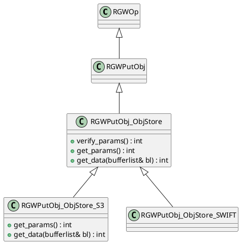
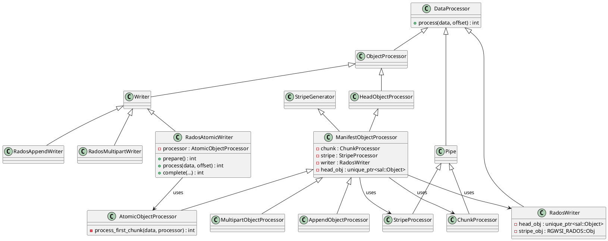
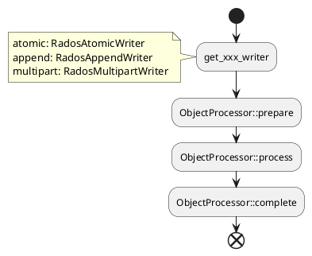
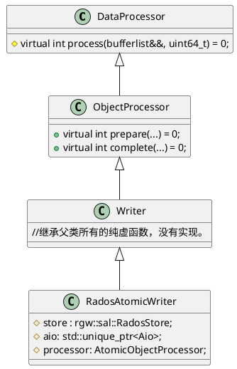
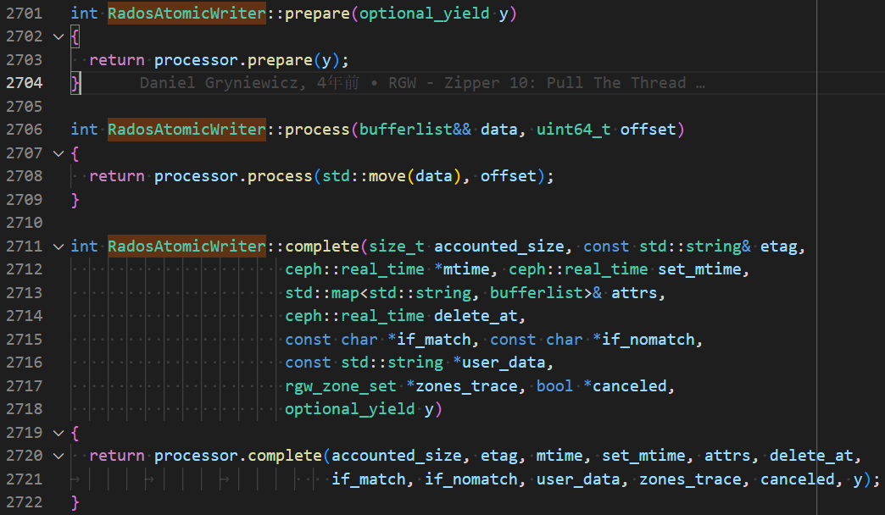
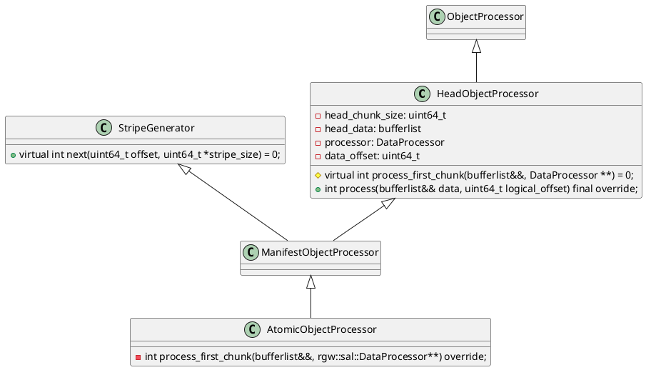
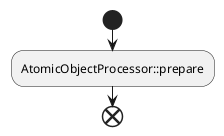
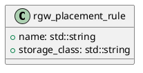

> rgw支持S3和Swift协议，我们目前主要分析S3协议下的对象上传流程。




```c++
RGWOp::execute
  sal::Bucket::check_quota

```




`RadosAtomicWriter`本质上就是`AtomicObjectProcessor`的 wrapper/proxy。

`AtomicObjectProcessor::prepare`计算出`head size` 和 `stripe size`,并初始化`ChunkProcessor`和`StripeProcessor`


目前，rgw支持三种上传方式：
1. multipart
2. append
3. atomic


## 通用流程



## Atomic上传
### RadosAtomicWriter


接下来看看`RadosAtomicWriter`的实现：


所以，`RadosAtomicWriter`其实就是`AtomicObjectProcessor`的proxy。rgw为啥这样设计呢？

[**待修改**]在旧版本的rgw代码中，Writer相关的API和Rados的耦合十分严重。从Qunicy版本，rgw引入了DBStore，为了兼容不同的存储底座，需要抽象出一套通用的API（其实就是Writer，从Store::get_xxx_writer的返回值就可以看出来）用于对象上传。
同时，为了复用已有的Rados Atomic上传的代码，就使用了代理模式，使之兼容新的Writer API。
[其实我也搞不清这是代理模式还是适配器模式](https://www.cnblogs.com/gocode/p/proxy-pattern-and-adapter-pattern.html)


### AtomicObjectProcessor







