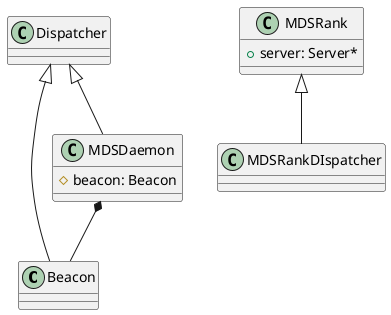
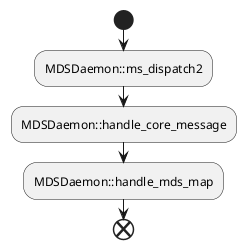
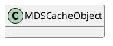
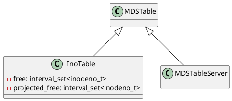
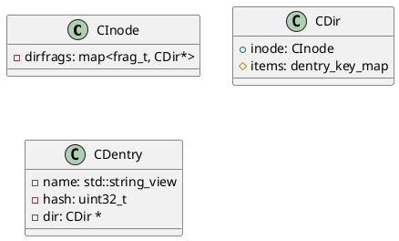

MDS初始化时，仅创建一个`Messneger`,在`MDSDaemon::init`中，将`Beacon` 和 `MDSDaemon`作为`Dispacther`添加到`Messenger`中，其中，`Beacon`为fast dispatcher。

通常，我们实现Dispatcher时，如果我们希望该Dispatcher成为fast dispatcher，需要重写`ms_can_fast_dispatch2`并返回true。在消息分发时，会直接调用`Dispatcher::ms_fast_dispatch2`来处理消息。如果不是fast dispatcher，Message会进入消息队列中。


这里其实存在一个疑问，`Beacon`其实只需要处理`MSG_MDS_BEACON`类型的消息，但是由于其实fast dispatcher，所有Message最终都要进入其`ms_dispatch2`中，这样就会多了几次函数调用以及条件判断操作。对性能的影响待评估。

## MDS内部数据结构

1. CInode

    一个文件对应一个CInode，其包含文件的Metadata，比如文件大小、所有者等。(目录也可以看成是一个文件)

2. CDir
    
    仅存在于目录的CInode中，用于链接目录下的CDentris。当目录碎片化时，一个CInode可以有多个CDir。

## InodeTable

1. ceph-fuse 挂载fs到 data目录
2. 创建 /data/timo
3. 创建/data/timo/test

在进入到handle_client_mkdir前，已经获取到filepath。其中包含 /data/timo的ino。根据该ino，可以获取到/data/timo的CInode。

然后根据 filepath中的 path字段(test)，获取对应的 frag_t（对于新创建的文件夹，该值为默认值），最后根据frag_t获取到 与之关联的CDir。

然后调用CDir::lookup查找path对应的CDentry，mkdir时，此步骤返回值为空。

因此，会创建一个空的CDentry，并添加到CDir::items中。

> 从代码理解，默认的frag_t关联的就是上级目录的CDir。

MDCache::path_traverse

add_null_dentry

创建CDentry，name == test
