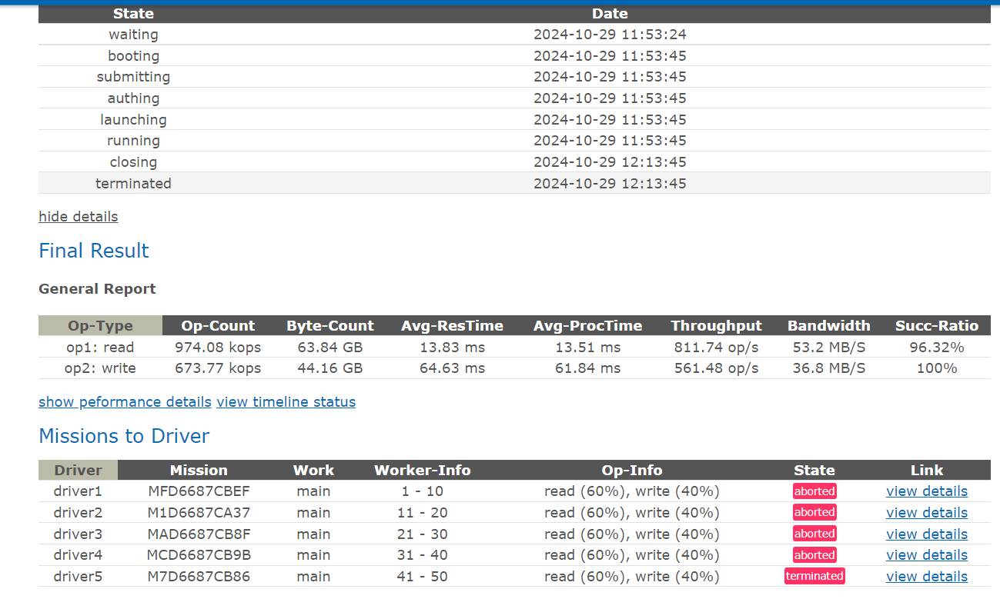
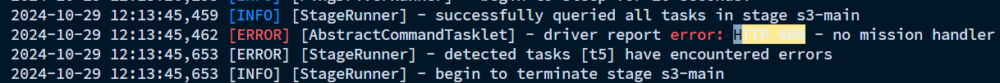
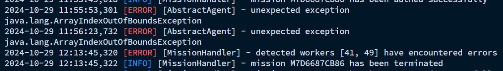

## 1. 在mission即将结束时terminated

如图，这是一个20min的7:3读写测试，在mission运行20min结束后，有一个mission提示 terminated。查看system.log日志：


这里只报了一个no mission handler的错误。搜索cosbench源码，只有三个阶段会报该错误：
1. login
2. launch
3. close
结合我们的现象（快结束时报错），应该是close阶段了。

查看对应的drvier代码:
```java
//dev/cosbench-driver/src/com/intel/cosbench/driver/service/COSBDriverService.java
@Override
public void close(String id) {
    MissionHandler handler = handlers.get(id);
    if (handler == null)
        throw new IllegalStateException("no mission handler");
    LOGGER.debug("closing mission {} ... ", id);
    handler.close();
    LOGGER.debug("mission {} has been closed", id);
}

@Override
public void missionStopped(MissionContext mission) {
    String id = mission.getId();
    MissionHandler handler = handlers.remove(id);
    handler.dispose();
    LOGGER.debug("handler for mission {} has been detached", id);
}
```
额，`handlers`找不到指定的id？？？？ 那只有一种可能，就是在此之前，`missionStopped`被调用了。

从第一张图里面可以看出，close阶段的前一个阶段是running,也就是压测阶段，查看相应的代码：
```java
//dev/cosbench-driver/src/com/intel/cosbench/driver/service/MissionHandler.java
public void stress() {
    String id = missionContext.getId();
    try {
        stressTarget();
    } catch (TimeoutException te) {
        /* no need to shutdown agents again */
        boolean shutdownNow = false;
        abortAgents(shutdownNow);
          missionContext.setState(ABORTED);
        return;
    } catch (AbortedException ae) {
        /* have to shutdown agents now */
        boolean shutdownNow = true;
        abortAgents(shutdownNow);
        missionContext.setState(ABORTED);
        return;
    } catch (MissionException me) {
        missionContext.setState(TERMINATED);
        LOGGER.info("mission {} has been terminated", id);
        return;
    } catch (Exception e) {
        missionContext.setState(TERMINATED);
        LOGGER.error("unexpected exception", e);
        LOGGER.info("mission {} has been terminated", id);
        return;
    }
    LOGGER.info("mission {} has been executed successfully", id);
}
```
`missionContext.setState`在state为`ABORTED`和`TERMINATED`就会调用`missionStopped`。我们的日志等级设置为`INFO`，但是很奇怪，20、25行的info日志都没有打印出来到system.log中。
仔细看一下system.log，甚至没有发现driver相关的日志打印，那driver的日志打印到哪去了？

那我们在log目录下搜索关键字`mission {} has been terminated`，最终在system.log.5里面找到了：



去github issue 搜索，最后找到了问题：https://github.com/fvennetier/cosbench/commit/360c6d0c14d825848f7d38b3e2a90a8976d0beda

还是存在一点疑问，为什么这里打印的堆栈信息就一行~~~，通过其他手段复现terminated现象时，打印出来的堆栈信息又很详细。。。