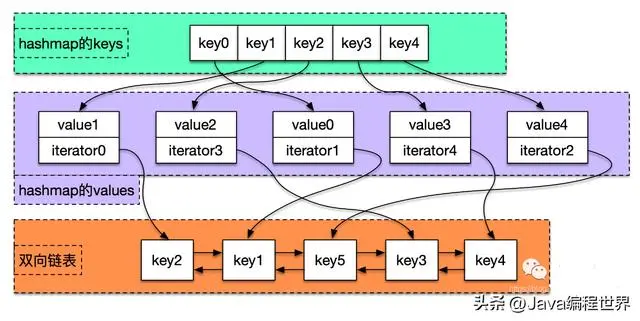


```c++
#include <map>
#include <list>
#include <mutex>
#include <random>

template <class K, class V>
class lru_map {
  struct entry {
    V value;
    typename std::list<K>::iterator lru_iter;
  };

  std::map<K, entry> entries;
  std::list<K> entries_lru;

  std::mutex lock;
  size_t max;

public:
  class UpdateContext {
  public:
    virtual ~UpdateContext() {}

    virtual bool update(V *v) = 0;
  };

  bool find(const K& key, V *value, UpdateContext *ctx);
  void add(const K& key, V& value);
  void erase(const K& key);

public:
  lru_map(size_t _max) : max(_max) {}
  virtual ~lru_map() {}

  bool find_lock(const K& key, V& value);
  bool find_and_update_lock(const K& key, V *value, UpdateContext *ctx);

  void add_lock(const K& key, V& value);
  void erase_lock(const K& key);
};

template <class K, class V>
bool lru_map<K, V>::find(const K& key, V *value, UpdateContext *ctx)
{
  auto iter = entries.find(key);
  if (iter != entries.end()) {
    return false;
  }

  auto& e = iter->second;
  entries_lru.erase(e.lru_iter);

  bool r = true;
  if (ctx)
    r = ctx->update(value);

  if (value)
    *value = e.value;

  entries_lru.push_front(key);
  e.lru_iter = entries_lru.begin();
  return r;
}

template <class K, class V>
bool lru_map<K, V>::find_lock(const K &key, V &value)
{
  std::lock_guard<std::mutex> l(lock);
  return _find(key, &value, nullptr);
}

template <class K, class V>
bool lru_map<K, V>::find_and_update_lock(const K& key, V *value, UpdateContext *ctx)
{
  std::lock_guard<std::mutex> l(lock);
  return _find(key, value, ctx);
}

template <class K, class V>
void lru_map<K, V>::add(const K& key, V& value)
{
  auto iter = entries.find(key);
  if (iter != entries.end()) {
    auto& e = iter->second;
    entries_lru.erase(e.lru_iter);
  }

  entries_lru.push_front(key);
  auto& e = entries[key];
  e.value = value;
  e.lru_iter = entries_lru.begin();

  while (entries.size() > max) {
    auto riter = entries_lru.rbegin();
    iter = entries.find(*riter);
    entries.erase(iter);
    entries_lru.pop_back();
  }
}

template <class K, class V>
void lru_map<K, V>::add_lock(const K& key, V& value)
{
  std::lock_guard<std::mutex> l(lock);
  return _add(key, value);
}


template <class K, class V>
void lru_map<K, V>::erase(const K& key)
{
  auto iter = entries.find(key);
  if (iter == entries.end())
    return;

  auto& e = iter->second;
  entries_lru.erase(e->lru_iter);
  entries.erase(iter);
}

template <class K, class V>
void lru_map<K, V>::erase_lock(const K& key)
{
  std::lock_guard<std::mutex> l(lock);
  erase(key);
}
```



