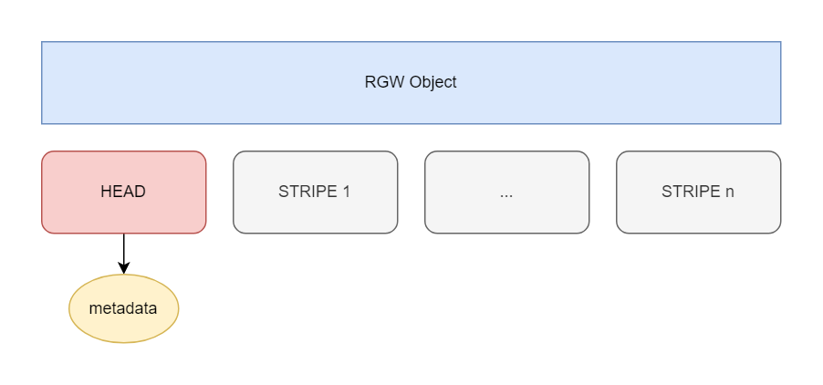

# RGW Data Layout
rgw的数据大致可以分为三类：
1. metadata
2. bucket index
3. data

## metadata

## bucket index

## data



一个RGW对象由一个或者多个RADOS对象组成。第一个对象称为头对象，其余的可以称为条带对象。

!!! note 补充
    头对象的xattrs中保存着对象的元数据：manifest, ACLs, content type, ETag, and user-defined metadata.


rgw定义了一些配置项来控制头对象和条带对象的大小：
| 配置项|作用|
| --- | --- |
| rgw_max_chunk_size | <ol><li>Defines the RGW head object size</li><li>The size of RADOS I/O requests that RGW sends when accessing data objects</li></ol>|
| rgw_obj_stripe_size | The size of an object stripe for RGW objects. |


我们将 `rgw_max_chunk_size`设置为2M，rgw_obj_stripe_size设置为3M：
```shell
ceph daemon out/radosgw.8888.asok config set  rgw_obj_stripe_size 5242880
ceph daemon out/radosgw.8888.asok config set  rgw_max_chunk_size 2097152
```
我们上传一个12M的对象到指定桶，查看数据池中的信息：
```shell
$ rados -p default.rgw.buckets.data ls
2903eeda-5acf-48fc-b9a4-f11fd4ac6f8e.4166.1__shadow_.EnJ8wBRaKXyD98a7n-B27WohwvYjLR1_2
2903eeda-5acf-48fc-b9a4-f11fd4ac6f8e.4166.1_12M
2903eeda-5acf-48fc-b9a4-f11fd4ac6f8e.4166.1__shadow_.EnJ8wBRaKXyD98a7n-B27WohwvYjLR1_1

$ rados -p default.rgw.buckets.data stat 2903eeda-5acf-48fc-b9a4-f11fd4ac6f8e.4166.1_12M
default.rgw.buckets.data/2903eeda-5acf-48fc-b9a4-f11fd4ac6f8e.4166.1_12M mtime 2024-10-22T15:11:55.000000+0800, size 2097152

$ rados -p default.rgw.buckets.data stat 2903eeda-5acf-48fc-b9a4-f11fd4ac6f8e.4166.1__shadow_.EnJ8wBRaKXyD98a7n-B27WohwvYjLR1_1
default.rgw.buckets.data/2903eeda-5acf-48fc-b9a4-f11fd4ac6f8e.4166.1__shadow_.EnJ8wBRaKXyD98a7n-B27WohwvYjLR1_1 mtime 2024-10-22T13:57:51.000000+0800, size 5242880

$ rados -p default.rgw.buckets.data stat 2903eeda-5acf-48fc-b9a4-f11fd4ac6f8e.4166.1__shadow_.EnJ8wBRaKXyD98a7n-B27WohwvYjLR1_2
default.rgw.buckets.data/2903eeda-5acf-48fc-b9a4-f11fd4ac6f8e.4166.1__shadow_.EnJ8wBRaKXyD98a7n-B27WohwvYjLR1_2 mtime 2024-10-22T13:57:51.000000+0800, size 5242880
```
可以看到，12M的对象分成了一个头对象和两个条带对象。头对象大小为2M，条带对象大小为5M。


再来看看头对象和条带对象的命名规则

- 头对象: <span class="label label-primary">\<marker>_\<key></span>
- 条带对象: <span class="label label-primary">\<marker>__shadow_\<prefix>\<stripe_id></span>

 : bucket marker

 : 对象名

 : 随机字符串

 : 条带id

!!! note bucket marker
    在rgw中，每个bucket 都有一个marker和bucket_id，桶刚创建时，marker和bucket_id是相等的。他们的区别在于marker是恒定不变的，而bucket_id是可变的（当桶重分片时，bucket_id就会发生变化）。
    
    ```C++
    void RGWRados::create_bucket_id(string *bucket_id)
    {
      uint64_t iid = instance_id(); //rgw重启后变化
      uint64_t bid = next_bucket_id(); //rgw重启后重新从1开始递增
      char buf[svc.zone->get_zone_params().get_id().size() + 48];
      snprintf(buf, sizeof(buf), "%s.%" PRIu64 ".%" PRIu64,
              svc.zone->get_zone_params().get_id().c_str(), iid, bid); //zone_id
      *bucket_id = buf;
    }
    ```
    所以，marker是由 `instance_id + bucket_id + zone_id` 组成的。
    


