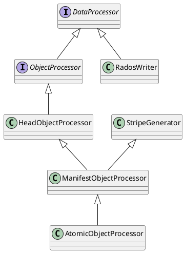

## 整体上传的对象的结构

```plantuml
@startuml

interface DataProcessor {
}

interface ObjectProcessor extends DataProcessor {}

class HeadObjectProcessor extends ObjectProcessor {}


class RadosWriter extends DataProcessor{}

class ManifestObjectProcessor extends HeadObjectProcessor, StripeGenerator{}

class AtomicObjectProcessor extends ManifestObjectProcessor{}
@enduml
```