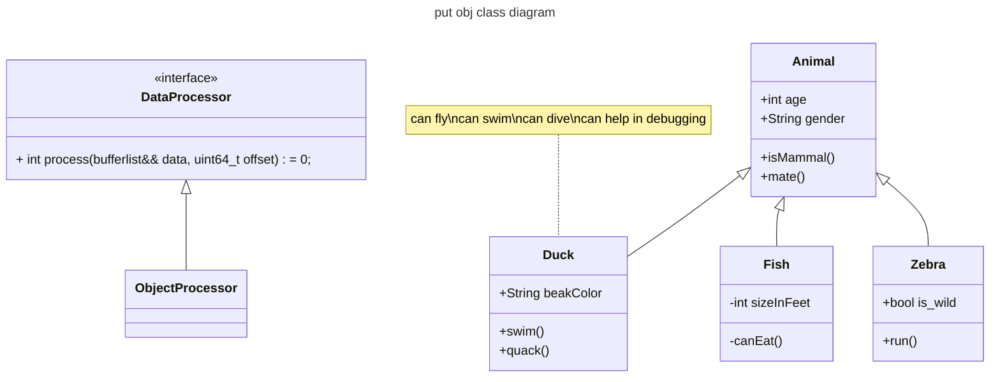
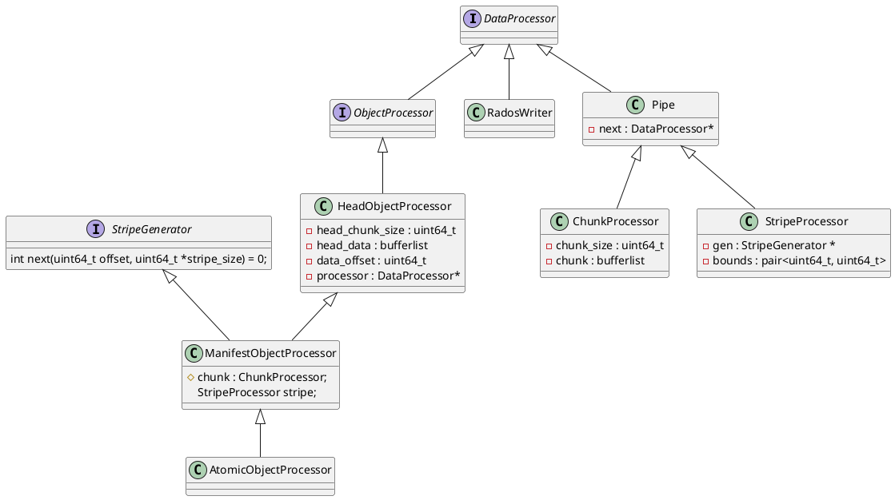

## 整体上传的对象的结构

```mermaid
---
title: put obj class diagram
---
classDiagram
    class DataProcessor {
      <<interface>>
      + int process(bufferlist&& data, uint64_t offset) = 0;
    }
    DataProcessor <|-- ObjectProcessor
    Animal <|-- Duck
    note for Duck "can fly\ncan swim\ncan dive\ncan help in debugging"
    Animal <|-- Fish
    Animal <|-- Zebra
    Animal : +int age
    Animal : +String gender
    Animal: +isMammal()
    Animal: +mate()
    class Duck{
        +String beakColor
        +swim()
        +quack()
    }
    class Fish{
        -int sizeInFeet
        -canEat()
    }
    class Zebra{
        +bool is_wild
        +run()
    }
```

```plantuml
@startuml

interface DataProcessor {
}

interface ObjectProcessor extends DataProcessor {}

interface StripeGenerator {
  int next(uint64_t offset, uint64_t *stripe_size) = 0;
}

class RadosWriter extends DataProcessor{}

class ManifestObjectProcessor extends HeadObjectProcessor, StripeGenerator {
  # chunk : ChunkProcessor;
  StripeProcessor stripe;
}

class AtomicObjectProcessor extends ManifestObjectProcessor{}


class Pipe extends DataProcessor {
 - next : DataProcessor*
}

class ChunkProcessor extends Pipe {
 - chunk_size : uint64_t
 - chunk : bufferlist
}

class StripeProcessor extends Pipe {
 - gen : StripeGenerator *
 - bounds : pair<uint64_t, uint64_t>
}

class HeadObjectProcessor extends ObjectProcessor {
  - head_chunk_size : uint64_t
  - head_data : bufferlist
  - data_offset : uint64_t
  - processor : DataProcessor*
}

 StripeGenerator .[hidden] HeadObjectProcessor

@enduml
```

