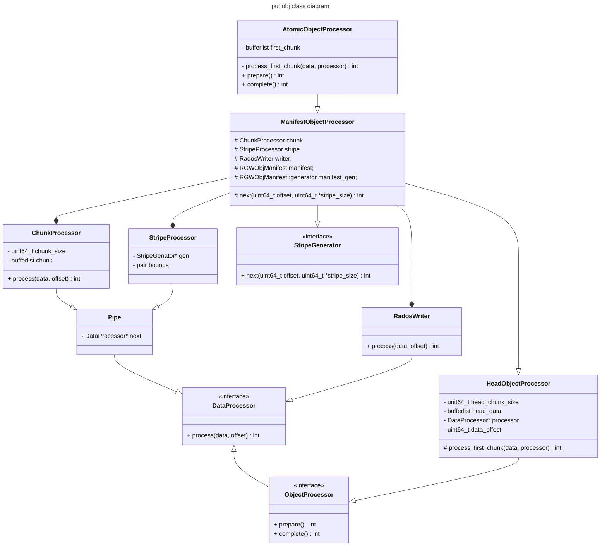

## 整体上传的对象的结构

```mermaid
---
title: put obj class diagram
theme: default
---
classDiagram
  class DataProcessor {
    <<interface>>
    + process(data, offset) int
  }
  class ObjectProcessor {
    <<interface>>
    + prepare() int
    + complete() int
  }
  DataProcessor <|-- ObjectProcessor

  class Pipe {
    - DataProcessor* next
  }

  Pipe --|> DataProcessor

  class ChunkProcessor {
    - uint64_t chunk_size
    - bufferlist chunk
    + process(data, offset) int
  }

  class StripeProcessor {
    - StripeGenator* gen
    - pair<uint64_t, uint64_t> bounds
  }

  ChunkProcessor --|> Pipe
  StripeProcessor --|> Pipe

  class RadosWriter {
    + process(data, offset) int
  }
  RadosWriter --|> DataProcessor

  class HeadObjectProcessor {
    - unit64_t head_chunk_size 
    - bufferlist head_data
    - DataProcessor* processor
    - uint64_t data_offest
    # process_first_chunk(data, processor) int
  }
  HeadObjectProcessor --|> ObjectProcessor

  class StripeGenerator {
    <<interface>>
    + next(uint64_t offset, uint64_t *stripe_size) int
  }

  class ManifestObjectProcessor {
    # ChunkProcessor chunk
    # StripeProcessor stripe
    # RadosWriter writer;
    # RGWObjManifest manifest;
    # RGWObjManifest::generator manifest_gen;
    # next(uint64_t offset, uint64_t *stripe_size) int
  }
  ManifestObjectProcessor --* RadosWriter
  ManifestObjectProcessor --* ChunkProcessor
  ManifestObjectProcessor --* StripeProcessor

  ManifestObjectProcessor --|> StripeGenerator
  ManifestObjectProcessor --|> HeadObjectProcessor

  class AtomicObjectProcessor {
    - bufferlist first_chunk
    - process_first_chunk(data, processor) int
    + prepare() int
    + complete() int
  }

  AtomicObjectProcessor --|> ManifestObjectProcessor
```

在中我们知道， 