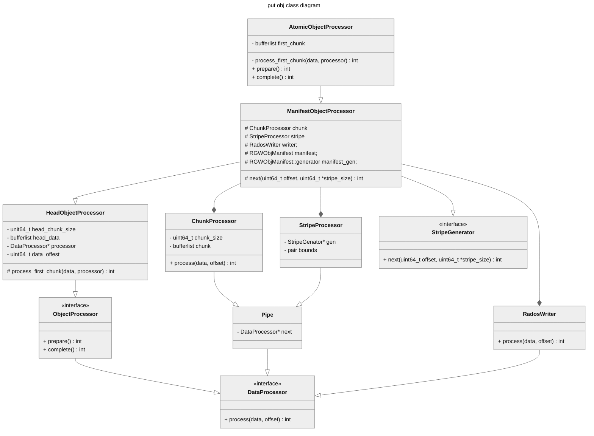
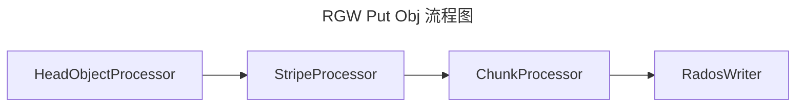
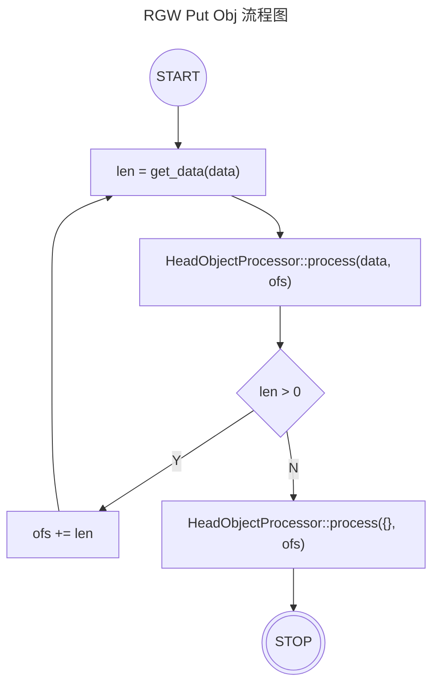

## 整体上传的对象的结构




在中我们知道rgw 对象有几个size相关的参数：
1. Max Head size (rgw_max_chunk_size)
2. Max Stripe size (rgw_obj_stripe_size)
3. Max Chunk size (rgw_max_chunk_size)

在RGW整体上传流程中，对Head、Stripe、Chunk的处理采用的是责任链模式。




当我们上传对象时，rgw首先接受到的是Head Obj Data，rgw会将其保存到 HeadObjectProcessor::head_data中。当满足特定条件时，会调用process_first_chunk处理 head_data。具体的条件如下:
1. head_data.length() == Max Head Size(rgw_max_chunk_size)
2. 第二次调用HeadObjectProcessor::process({}, ofs);


```c++
int HeadObjectProcessor::process(bufferlist&& data, uint64_t logical_offset)
{
  const bool flush = (data.length() == 0);
  if (data_offset < head_chunk_size || data_offset == 0) {
    if (flush) {
      // 如果obj size < head_chunk_size, 那只能通过flush来写入head obj
      return process_first_chunk(std::move(head_data), &processor);
    }
    // 这里最多只处理 head_chunk_size的数据
    auto remaining = head_chunk_size - data_offset;
    auto count = std::min<uint64_t>(data.length(), remaining);
    data.splice(0, count, &head_data);
    data_offset += count;
    // 当obj size >= head_chunk_size 时， 该条件总是可以满足
    if (data_offset == head_chunk_size) {
      int r = process_first_chunk(std::move(head_data), &processor);
    }
    if (data.length() == 0) {
      return 0;
    }
  }
  // 如果data还有数据待处理，就交给 StripeProcessor::process处理。
  auto write_offset = data_offset;
  data_offset += data.length();
  return processor->process(std::move(data), write_offset);
}
```
process_first_chunk实现比较简单：
```c++
int AtomicObjectProcessor::process_first_chunk(bufferlist&& data,
                                               DataProcessor **processor)
{
  first_chunk = std::move(data);
  *processor = &stripe;
  return 0;
}
```
将head obj data 保存到first_chunk中(在complete中处理)。然后将是将processor赋值为stripe。
此后，条带对象数据处理的入口就都是`StripeProcessor::process`。



