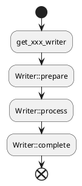
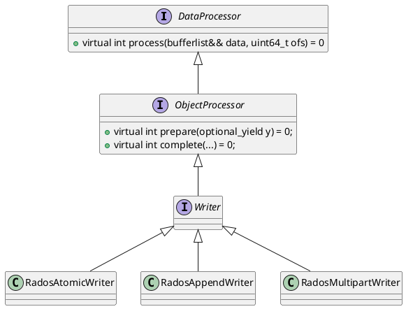

## RGW支持的上传方式
RGW支持三种类型的上传方式，分别是：
1. Atomic
2. Multipart
3. Append

当我们上传对象时，rgw是如何区分这三种上传方式的呢？

### Multipart
当客户端使用Multipart方式上传时，请求格式如下：
`PUT /Key+?partNumber=PartNumber&uploadId=UploadId HTTP/1.1`。
rgw就是根据http 参数中是否包含uploadId来判断是否是 Multipart方式上传。

> [aws S3 api Upload UploadPart](https://docs.aws.amazon.com/AmazonS3/latest/API/API_UploadPart.html)

```c++
std::unique_ptr<rgw::sal::Writer> processor;
multipart_upload_id = s->info.args.get("uploadId");
const bool multipart = !multipart_upload_id.empty();
if (multipart) {
  std::unique_ptr<rgw::sal::MultipartUpload> upload;
  upload = s->bucket->get_multipart_upload(s->object->get_name(), multipart_upload_id);
  processor = upload->get_writer(...);
}
```

### Append
> 追加写方式在S3协议中并没有找到相应说明，应该是rgw扩展的。

当客户端通过Append方式上传对象时，请求如下：
`PUT /bucket1/hello?append&position=6 HTTP/1.1`
和Multipart类似，rw也是根据http 请求参数中是否包含 append来判断是否是Append方式上传。
```c++
std::unique_ptr<rgw::sal::Writer> processor;
append = s->info.args.exists("append");
if(append) {
  // 可以看到，当桶开启多版本时，是不允许追加写的。
  if (s->bucket->versioned()) {
    op_ret = -ERR_INVALID_BUCKET_STATE;
    return;
  }
  processor = store->get_append_writer(...);
  } 
```
### Atomic

如果既不是Multipart 也不是Append，那就是Aotmic咯。
```c++
std::unique_ptr<rgw::sal::Writer> processor;
processor = store->get_atomic_writer(...);
```

## RGW对象上传流程

如前所述，rgw根据客户端的上传方式获取到对应的 Writer实例，然后依次调用其`prepare`->`process`->`compelete`成员函数即可完成对象上传操作。



最后，来看一下rados后端这三种上传初始对应的Writer的类图。


